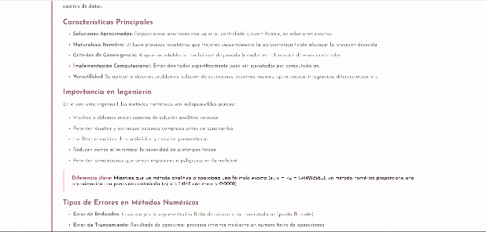
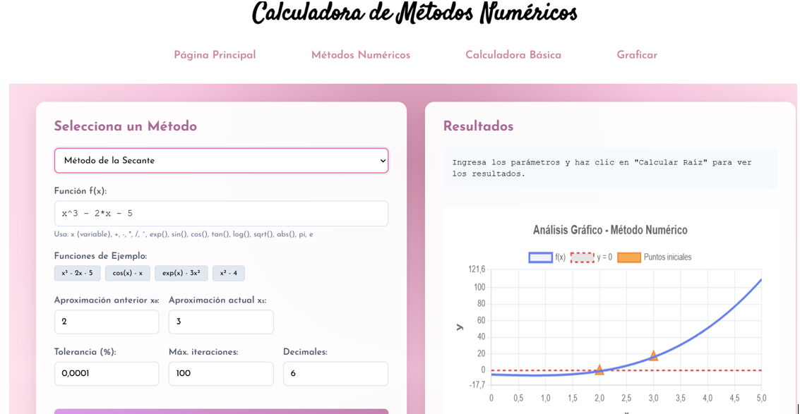
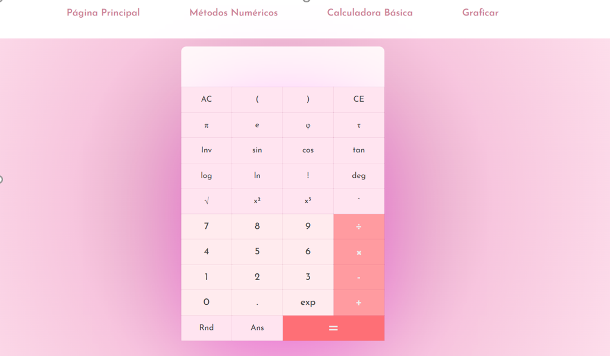
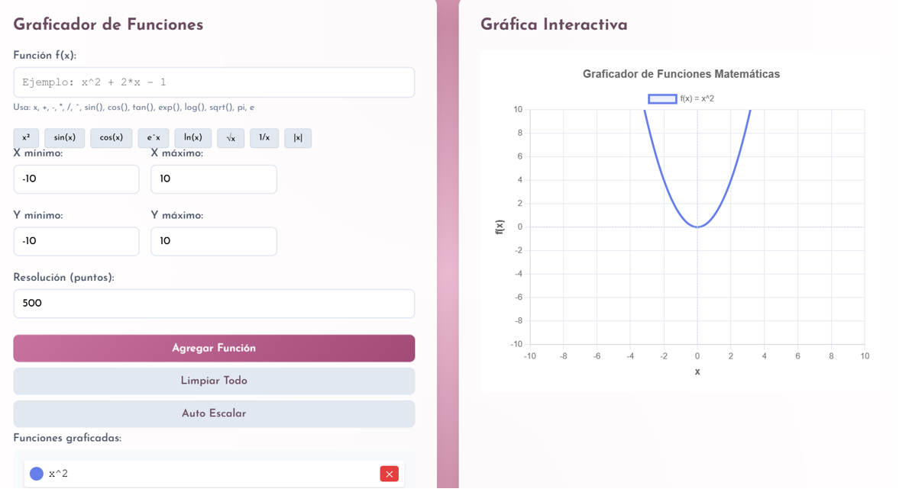

# 🧮 Calculadora de Métodos Numéricos

Aplicación web interactiva orientada al aprendizaje y desarrollo de los métodos numéricos, así como su aplicación en ingeniería. El sistema permite hallar la raíz de una función, visualizarlas y realizar cálculos científicos.

## 🚀 Características principales

- ✅ Ejecución local desde navegador moderno
- ✅ 4 Métodos Numéricos implementados para solución de ecuaciones no lineales
- ✅ Interfaz intuitiva
- ✅ Validación de funciones matemáticas en tiempo real
- ✅ Visualización gráfica de funciones
- ✅ Tabla de iteraciones para análisis numérico
- ✅ Calculadora científica integrada

## 🧩 Arquitectura del sistema

La aplicación se encuentra organizada en cuatro módulos principales:

### 🏠 Módulo principal

Funciona como la página de inicio e introduce los fundamentos teóricos de los métodos numéricos. Además, presenta un ejemplo aplicativo de ingeniería eléctrica basado en un circuito RLC, adaptdo del libro Métodos Numéricos para Ingenieros de Chapra y Canale.

### 🔢 Calculadora de Métodos Numéricos

Es parte principal del sistema, permite a los usuarios trabajar con sus propias funciones. Incluye los siguientes métodos: 

- Bisección
- Newton-Raphson
- Secante
- Müller

Posee un selector dinámico de método junto a campos adaptables según el algoritmo seleccionado; así como una tabla detallada de iteraciones y un gráfico automático de la función y la raíz estimada. También permite la configuración de tolerancia, iteraciones y decimales.

### 🧮  Calculadora Científica

Complementa el sistema permitiendo realizar operaciones de apoyo durante los cálculos en el mismo entorno. Incluye:

- Operaciones básicas
- Funciones trigonométricas e inversas
- Logaritmos y exponenciales
- Potencias y raíces
- Constantes matemáticas (π, e, φ, τ)
- Número aleatorio (Rnd)
- Reutilización del último resultado (Ans)

El sistema controla el balanceo de paréntesis, errores sintácticos y sincronización entre interfaz y cálculo

### 📊 Graficador de funciones

Herramienta visual diseñada para analizar el comportamiento de funciones matemáticas y estimar su raíz gráficamente. Permite:

- Graficar una o múltiples funciones
- Configurar rango de valores
- Ajustar la resolución
Además cuenta con:
- Plano cartesiano con escalado automático
- Línea de referencia en y = 0 para identificar raíces
- Tooltip con coordenadas aproximadas
- Eliminación individual de funciones
- Actualización en tiempo real sin recargar la página

El graficador funciona dividiendo el intervalo en puntos equidistantes, evaluand luego cada uno de ellos para generar una curva continua y precisa.

## 🛠️ Tecnologías utilizadas

- HTML5 -> estructura del sistema
- CSS3 -> diseño 
- JavaScript -> lógica de la aplicación
- Math.js -> cálculos, procesamiento simbólico y numérico
- Chart.js -> visualización gráfica
- jQuery -> manejo de eventos

## 🚀 Instalación y uso

### Opción 1: Clonar Repositorio
1. Clona el repositorio:
 `git clone https://github.com/tu-usuario/tu-repositorio.git ` 
2. Accede a la carpeta del proyecto.
3. Ejecuta el archivo:
 `index.html ` 

### Opción 2: Descargar ZIP
1. Click en Code --> Download ZIP
2. Descomprimir el archivo
3. Abrir `index.html `  en el navegador

## 💻 Uso

1. Abrir la aplicación
   Abrir `index.html ` en el navegador
2. Seleccionar método
   Métodos Numéricos -> Elegir pestaña (Newton, Secante, Bisección, Müller)
3. Ingresar función
   Ejemplo: x^2 - 4
4. Configurar parámetros
   - Valor(es) inicial(es)
   - Tolerancia 
   - Decimales a mostrar
5. Calcular y visualizar
   -- > Click en "Calcular"
   
## 📚 Referencia

Chapra, Steven C., & Canale, Raymond P. (2011).
Métodos Numéricos para Ingenieros.

